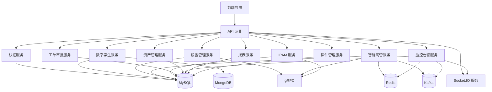
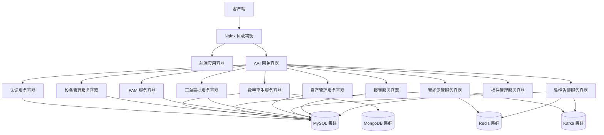
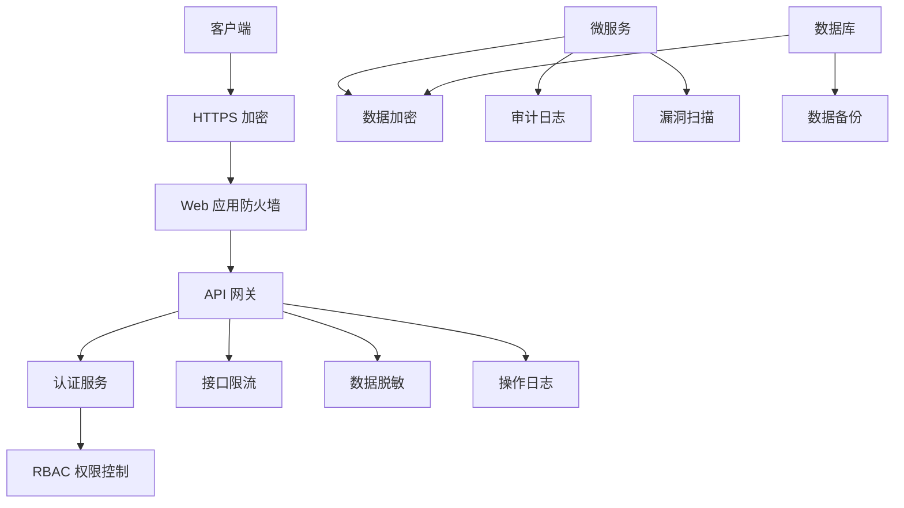
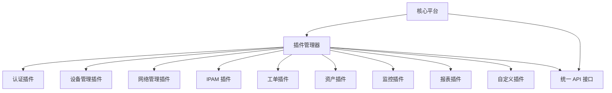

# 企业级 IDC 数字孪生机房一体化管理平台设计方案

## 1. 项目概述

### 1.1 项目定位
私有化部署、插件化、高可用、大规模机房集群管控的企业级 IDC 数字孪生一体化管理平台，基于 Node.js 全栈技术体系构建，覆盖数字孪生可视化、机房建模、设备管理、智能网管、IPAM、自动化运维、资产全生命周期、流程审批、安全管控、告警监控、报表大屏、权限审计、插件扩展全能力，支持电信级 / 企业级 IDC 机房、多站点、跨区域集群统一管控，架构可商用、可二次开发、可水平扩展。

### 1.2 核心价值
- **降本增效**：自动化运维、批量操作，大幅降低人工成本
- **全局可视**：数字孪生 1:1 还原，机房状态实时掌控
- **安全合规**：权限管控、操作审计、配置回溯，满足等保合规要求
- **统一管控**：多机房、多厂商、多协议设备统一平台管理
- **灵活扩展**：插件化架构，支持业务持续扩展与定制开发

## 2. 技术架构设计

### 2.1 技术栈选择

| 类别 | 技术 | 版本 | 选型理由 |
|------|------|------|----------|
| 前端框架 | Vue 3 + TypeScript + Vite | Vue 3.4+ | 类型安全、工程化规范、极速构建 |
| UI 组件 | Element Plus | 2.4+ | 企业级中台 UI、表单/表格/弹窗/审批流原生适配 |
| 3D 引擎 | Three.js + TresJS | Three.js 0.160+ | 数字孪生 3D 机房高精度渲染、性能优化 |
| 2D 可视化 | Canvas/SVG | - | 机房平面图编辑器、拓扑图编辑器 |
| 状态管理 | Pinia | 2.1+ | 模块化状态、持久化、多机房数据隔离 |
| 网络请求 | Axios | 1.6+ | 请求拦截、重试、缓存、日志埋点 |
| 实时通信 | Socket.IO | 4.7+ | 告警推送、设备状态实时刷新 |
| 后端框架 | Express | 4.18+ | 轻量级、灵活度高、适合微服务架构 |
| 服务通信 | gRPC | 1.60+ | 高性能服务间通信、适合微服务架构 |
| 消息队列 | Kafka | 3.6+ | 高吞吐量、可靠的消息传递 |
| 数据库 | MySQL 8.0+ | 8.0+ | 核心业务数据存储 |
| 缓存 | Redis | 7.0+ | 缓存、分布式锁、消息队列、限流 |
| 文档数据库 | MongoDB | 6.0+ | 日志、孪生模型、大文本存储 |
| 容器化 | Docker + Docker Compose | 20.10+ | 容器化部署、环境一致性 |
| 反向代理 | Nginx | 1.25+ | 负载均衡、静态资源服务 |

### 2.2 架构设计

#### 2.2.1 微服务架构

#### 2.2.2 核心架构特性

1. **插件化内核**：所有功能模块独立插件化设计，可插拔、可版本管理、可独立升级
2. **微服务架构**：核心功能拆分为独立微服务，通过 API 网关统一管理，支持独立部署和扩展
3. **前后端分离**：标准化 RESTful API，统一响应结构与错误码
4. **高并发支撑**：Redis 多级缓存、数据库索引优化、Kafka 消息队列削峰
5. **私有化部署**：纯内网运行、无外部依赖、数据本地化存储
6. **多机房集群**：统一平台纳管多个机房站点，支持数据与权限隔离

### 2.3 部署架构

#### 2.3.1 容器化部署

#### 2.3.2 部署环境要求

| 组件 | 配置要求 | 数量 |
|------|----------|------|
| 前端应用 | 2C4G | 2+ |
| API 网关 | 4C8G | 2+ |
| 微服务实例 | 2C4G | 每个服务 2+ |
| MySQL | 4C16G | 3 (主从) |
| Redis | 4C8G | 3 (集群) |
| MongoDB | 4C16G | 3 (副本集) |
| Kafka | 4C16G | 3 (集群) |
| Nginx | 2C4G | 2 (负载均衡) |

## 3. 核心功能模块设计

### 3.1 数字孪生可视化与机房建模编辑器

#### 3.1.1 功能特性
- **全真 1:1 数字孪生建模**：支持自定义机房尺寸、楼层、区域划分、通道/墙体/立柱/防火门绘制
- **2D 可视化编辑器**：拖拽式布局、网格吸附、坐标精准控制、撤销/重做/保存/导入导出
- **3D 高精度场景渲染**：Three.js + TresJS 实现光照、材质、阴影真实还原
- **2D ↔ 3D 视图无缝切换**：实时联动、数据双向同步
- **机柜与 U 位精细化可视化**：1U–42U 自定义规格与 U 位精准展示，颜色分级可视化
- **链路与端口 3D 可视化**：物理链路 3D 连线，链路状态实时渲染，端口可视化标注
- **场景交互与视图控制**：俯视、漫游、旋转、缩放、聚焦、快速定位
- **孪生模型管理**：机房模型保存、快照、导入导出、版本管理

#### 3.1.2 技术实现
- **前端**：Vue 3 + Three.js + TresJS + Canvas
- **后端**：Express 服务 + MongoDB (存储孪生模型)
- **数据流转**：前端建模 → 后端存储 → 实时同步 → 多端渲染

### 3.2 设备管理与型号模板库

#### 3.2.1 功能特性
- **设备型号模板体系**：多级设备分类，全品类覆盖，模板内置参数
- **设备全生命周期管理**：采购 → 入库 → 上架 → 变更 → 维保 → 巡检 → 故障 → 返修 → 报废 → 出库
- **批量操作**：批量上架、批量迁移机柜、批量修改、批量下架、批量导入
- **一物一码**：SN 码、资产编号、二维码/条码绑定，支持扫码运维、扫码盘点
- **维保管理**：维保周期、到期自动提醒、合同附件上传、维保履历留存
- **容量与功耗管理**：机柜 U 位使用率、机房总容量统计与可视化，PDU 实时功率监控

#### 3.2.2 技术实现
- **前端**：Vue 3 + Element Plus
- **后端**：Express 服务 + MySQL
- **数据流转**：设备模板 → 设备入库 → 设备上架 → 状态更新 → 报表统计

### 3.3 智能网管系统

#### 3.3.1 功能特性
- **插件化驱动架构**：设备协议与上层业务完全解耦，支持插件安装、启用、禁用、升级
- **多厂商兼容**：华为、华三、锐捷、思科、迈普、深信服、奇安信等主流品牌
- **协议支持**：SSH2、Telnet、SNMP v1/v2c/v3、HTTP/HTTPS API、CLI 适配
- **设备自动化纳管**：网段扫描、设备自动发现、在线探测、自动建档、型号自动匹配
- **配置自动化管理**：定时自动备份配置、配置加密存储、多版本对比与回溯
- **自动化巡检**：自定义巡检项、定时巡检、手动巡检、批量巡检
- **批量运维与策略中心**：批量执行命令、批量修改端口、批量配置 VLAN/ACL/QOS/链路聚合

#### 3.3.2 技术实现
- **前端**：Vue 3 + Element Plus
- **后端**：Express 服务 + gRPC + Kafka
- **数据流转**：设备发现 → 配置采集 → 状态监控 → 告警触发 → 工单流转

### 3.4 IPAM 管理系统

#### 3.4.1 功能特性
- **IP 地址池规划**：支持多网段、多 VLAN、多区域、多部门地址段树形划分
- **IP 全生命周期管理**：支持 IP 分配、回收、冻结、预留、禁用、批量导入导出
- **IP-MAC 绑定安全管控**：精准关联 IP + MAC + 设备 + 端口 + 机位 + 使用人 + 部门 + 用途
- **自动检测**：IP 冲突、MAC 异常漂移、私改 IP、非法接入并告警
- **绑定日志**：操作日志、异常行为日志永久留存

#### 3.4.2 技术实现
- **前端**：Vue 3 + Element Plus
- **后端**：Express 服务 + MySQL
- **数据流转**：IP 规划 → IP 分配 → 绑定管理 → 冲突检测 → 告警触发

### 3.5 其他核心模块

#### 3.5.1 工单审批系统
- **可视化流程引擎**：自定义审批流程，支持多级审批、会签/或签、条件分支
- **全流程自动化闭环**：审批通过自动执行 IP 分配、资产建档等操作
- **工单中心**：我的申请、我的待办、我的已办、全部工单

#### 3.5.2 资产管理系统
- **固定资产台账**：完整字段管理，支持批量导入导出、高级筛选
- **资产运营管理**：资产盘点、借用、调拨、变更、报废全流程记录
- **资产折旧计算**：资产分类占比、价值统计

#### 3.5.3 监控告警系统
- **环境监控接入**：对接动环监控系统，实时数据采集
- **智能告警体系**：多级告警、实时推送、告警自愈、告警转工单
- **告警统计**：故障复盘、趋势分析

#### 3.5.4 权限审计系统
- **细粒度权限控制**：基于 RBAC 权限模型，多维度权限管理
- **全方位日志审计**：登录日志、操作日志、设备操作日志等
- **系统安全加固**：JWT 认证、密码强度策略、登录失败锁定

#### 3.5.5 报表大屏系统
- **机房总览可视化大屏**：核心指标实时展示
- **多维度报表系统**：内置报表、自定义报表、周期统计
- **导出功能**：Excel、PDF、图片，支持定时自动发送

#### 3.5.6 系统基础能力
- **系统管理功能**：用户管理、部门管理、角色管理、岗位管理
- **插件扩展机制**：插件安装、升级、卸载、启用、禁用
- **大规模集群管理**：多机房、多站点、跨区域统一纳管

## 4. 数据库设计

### 4.1 核心数据表

#### 4.1.1 机房管理
- `data_center`：机房基本信息
- `floor`：楼层信息
- `area`：区域信息
- `rack`：机柜信息
- `u_position`：U 位信息

#### 4.1.2 设备管理
- `device_template`：设备型号模板
- `device`：设备基本信息
- `device_port`：设备端口信息
- `device_maintenance`：设备维保信息

#### 4.1.3 网络管理
- `network_segment`：网段信息
- `ip_address`：IP 地址信息
- `mac_address`：MAC 地址信息
- `link`：链路信息

#### 4.1.4 工单管理
- `workflow`：审批流程模板
- `ticket`：工单信息
- `ticket_node`：工单节点信息
- `ticket_approver`：工单审批人信息

#### 4.1.5 资产管理
- `asset`：资产基本信息
- `asset_transaction`：资产交易记录
- `asset_depreciation`：资产折旧信息

#### 4.1.6 监控告警
- `monitor_item`：监控项信息
- `alarm`：告警信息
- `alarm_rule`：告警规则信息

#### 4.1.7 系统管理
- `user`：用户信息
- `department`：部门信息
- `role`：角色信息
- `permission`：权限信息
- `plugin`：插件信息
- `log`：操作日志信息

### 4.2 数据存储策略

- **MySQL**：存储核心业务数据，采用主从复制保证高可用
- **Redis**：存储缓存数据、会话数据、分布式锁
- **MongoDB**：存储数字孪生模型、日志数据、大文本数据
- **Kafka**：存储消息队列数据，用于异步处理和削峰

## 5. 安全设计

### 5.1 安全架构

### 5.2 安全措施

1. **认证与授权**：
   - JWT 无状态认证
   - RBAC 细粒度权限控制
   - 密码强度策略
   - 登录失败锁定

2. **数据安全**：
   - 敏感数据加密存储
   - 数据传输加密 (HTTPS)
   - 数据备份与恢复
   - 操作日志不可篡改

3. **接口安全**：
   - 接口限流
   - 防 SQL 注入
   - 防 XSS 攻击
   - 防 CSRF 攻击

4. **网络安全**：
   - 网络隔离
   - 防火墙规则
   - IP 白名单
   - 安全组配置

5. **运维安全**：
   - 堡垒机接入
   - 操作审计
   - 漏洞扫描
   - 安全补丁管理

## 6. 性能优化策略

### 6.1 前端性能优化

1. **3D 渲染优化**：
   - LOD (Level of Detail) 技术
   - 视锥体剔除
   - 实例化渲染
   - 纹理压缩
   - 阴影优化

2. **前端资源优化**：
   - 代码分割
   - 懒加载
   - 缓存策略
   - 资源压缩

3. **交互优化**：
   - 防抖与节流
   - 虚拟滚动
   - 批量更新
   - Web Worker

### 6.2 后端性能优化

1. **服务优化**：
   - 微服务拆分
   - 负载均衡
   - 连接池管理
   - 异步处理

2. **数据库优化**：
   - 索引优化
   - 分表分库
   - 慢查询优化
   - 读写分离

3. **缓存优化**：
   - Redis 多级缓存
   - 缓存策略
   - 缓存一致性

4. **消息队列优化**：
   - Kafka 分区策略
   - 消息重试机制
   - 消息幂等性

## 7. 插件化扩展设计

### 7.1 插件架构

### 7.2 插件开发规范

1. **插件结构**：
   - 插件元数据
   - 插件配置
   - 插件依赖
   - 插件接口实现

2. **插件生命周期**：
   - 安装
   - 启用
   - 运行
   - 禁用
   - 卸载

3. **插件接口**：
   - 统一插件接口规范
   - 版本管理
   - 依赖管理
   - 冲突检测

## 8. 部署与运维

### 8.1 部署流程

1. **环境准备**：
   - 服务器准备
   - Docker 安装
   - 网络配置

2. **部署步骤**：
   - 拉取镜像
   - 配置环境变量
   - 启动容器
   - 初始化数据
   - 验证服务

3. **部署模式**：
   - 单机部署
   - 集群部署
   - 高可用部署

### 8.2 运维管理

1. **监控体系**：
   - 系统监控
   - 服务监控
   - 数据库监控
   - 网络监控

2. **日志管理**：
   - 日志收集
   - 日志分析
   - 日志归档

3. **故障处理**：
   - 故障定位
   - 故障恢复
   - 故障演练

4. **版本管理**：
   - 版本控制
   - 升级策略
   - 回滚机制

## 9. 项目交付标准

### 9.1 交付内容

1. **源代码**：
   - 前端源代码
   - 后端源代码
   - 插件源代码

2. **文档**：
   - 部署文档
   - 环境搭建脚本
   - Docker Compose 编排文件
   - 接口文档
   - 二次开发文档
   - 插件开发指南

3. **数据**：
   - 初始化数据脚本
   - 设备型号库
   - 默认审批流程模板

4. **工具**：
   - 运行时监控工具
   - 日志分析工具
   - 故障排查工具

### 9.2 验收标准

1. **功能验收**：
   - 核心功能实现
   - 性能指标达标
   - 安全要求满足

2. **技术验收**：
   - 代码质量
   - 架构合理性
   - 扩展性

3. **文档验收**：
   - 文档完整性
   - 文档准确性
   - 文档可读性

## 10. 项目实施计划

### 10.1 实施阶段

1. **需求分析与设计**：2 周
2. **核心框架搭建**：3 周
3. **数字孪生模块开发**：4 周
4. **设备管理模块开发**：3 周
5. **智能网管模块开发**：4 周
6. **IPAM 模块开发**：2 周
7. **其他模块开发**：6 周
8. **集成测试**：3 周
9. **性能优化**：2 周
10. **部署与交付**：2 周

### 10.2 团队配置

| 角色 | 人数 | 职责 |
|------|------|------|
| 项目经理 | 1 | 项目管理、协调沟通 |
| 架构师 | 1 | 技术架构设计、技术选型 |
| 前端开发 | 3 | 前端应用开发、3D 可视化 |
| 后端开发 | 4 | 后端服务开发、微服务实现 |
| 测试工程师 | 2 | 功能测试、性能测试、安全测试 |
| 运维工程师 | 1 | 部署运维、监控管理 |

## 11. 风险评估与应对策略

### 11.1 风险评估

| 风险 | 影响 | 概率 | 应对策略 |
|------|------|------|----------|
| 3D 渲染性能问题 | 影响用户体验 | 中 | 采用 LOD、视锥体剔除等优化技术 |
| 设备兼容性问题 | 影响设备纳管 | 中 | 建立多厂商设备驱动库，支持插件扩展 |
| 数据同步延迟 | 影响实时性 | 低 | 优化消息队列，使用 WebSocket 实时通信 |
| 系统安全漏洞 | 影响系统安全 | 低 | 定期安全扫描，及时更新补丁 |
| 部署复杂度 | 影响部署效率 | 中 | 提供自动化部署脚本，简化部署流程 |

### 11.2 应对策略

1. **技术风险**：
   - 建立技术预研机制
   - 采用成熟的技术栈
   - 定期技术评估

2. **项目风险**：
   - 建立项目监控机制
   - 制定详细的项目计划
   - 定期项目评审

3. **资源风险**：
   - 合理配置团队资源
   - 建立人才培养机制
   - 制定资源备份计划

4. **质量风险**：
   - 建立质量保证体系
   - 严格代码审查
   - 全面测试覆盖

## 12. 总结与展望

### 12.1 项目价值

- **技术价值**：构建基于 Node.js 全栈的企业级 IDC 管理平台，推动数字孪生技术在数据中心领域的应用
- **业务价值**：提升数据中心管理效率，降低运维成本，保障系统安全
- **社会价值**：促进数据中心智能化、数字化转型，支持数字经济发展

### 12.2 未来展望

- **功能扩展**：支持更多设备类型、更多协议、更多场景
- **技术升级**：引入 AI 技术，实现智能故障预测、智能运维建议
- **生态建设**：构建插件生态，支持第三方集成和二次开发
- **行业推广**：将平台推广到更多行业，如金融、电信、互联网等

---

本设计方案基于企业级需求，采用先进的技术栈和架构设计，确保平台的可靠性、安全性、可扩展性和可维护性。通过数字孪生技术和自动化运维，实现数据中心的智能化管理，为企业提供全方位的 IDC 管理解决方案。